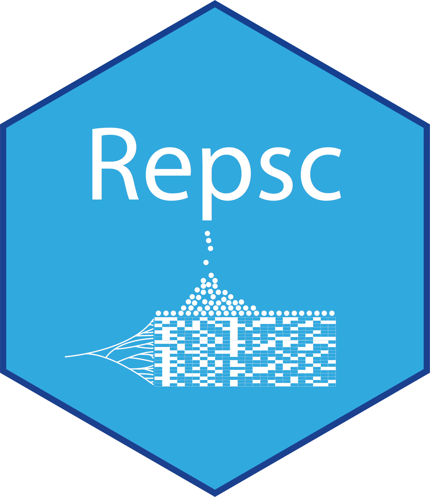
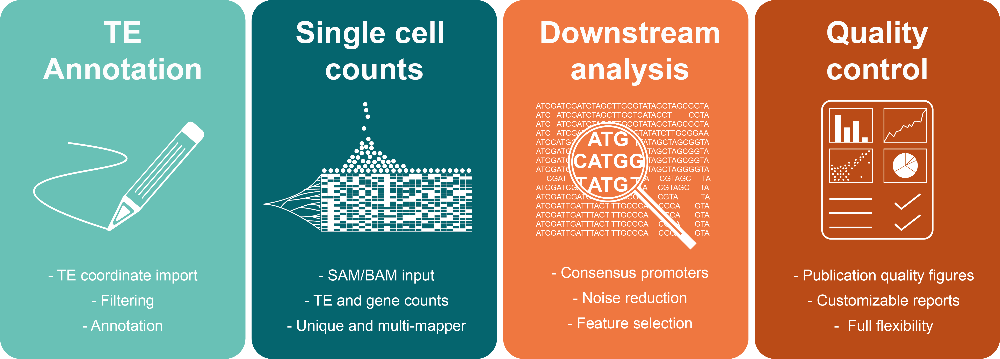

```{r, echo = FALSE}
knitr::opts_chunk$set(
  collapse = TRUE,
  comment = "#>",
  fig.path = "README-"
)
```

# Repsc 

The Repsc R package is a _beta_ development version to facilitate expression analysis of transposable elements at single-cell resolution.

### Functionality

The basic workflow consists of importing genome annotation/sequencing reads, curating TE and gene intervals, counting overlaps, and generating the single-cell matrix. Repsc supports a wide range of protocols, including 5'/3' and full-coverage based methods, but for unambiguous assignment of reads to de-repressed TE loci we recommend 5' based protocols:

```{r pressure, echo = FALSE, out.width = '90%', fig.align='center'}

```
 
#### Features include:
 * Multi-species support
 * Flexible genome annotation
 * Gene and TE curation
 * 5'/3'/full-coverage support
 * High-quality reports
 
More details on the usage of Repsc is available in the package [vignette](https://tanaylab.bitbucket.io/Repsc/articles/Repsc.html). 

### Installation

```{r, eval=FALSE}
# Install BiocManager (in case you haven't already)
if (!requireNamespace("BiocManager", quietly = TRUE))
    install.packages("BiocManager")
    
# Install Remotes (in case you haven't already)
if (!requireNamespace("remotes", quietly = TRUE))
    install.packages("remotes")

# Install Repsc
remotes::install_github('Repsc', repos = 'tanaylab.bitbucket.io/repo')
```

**Note**: Repsc requires R version 3.5 or higher. The package was tested on linux. We are working on reducing memory usage, but currently a typical application will require at least 12 GB RAM, but heavier use cases (e.g. large BAM files) may require significantly more. For improved speed performance, we recommend a multi-CPU/core workstation, or ideally a HPC infrastructure.